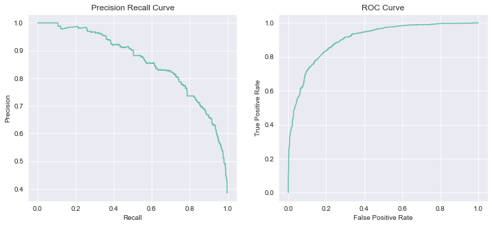
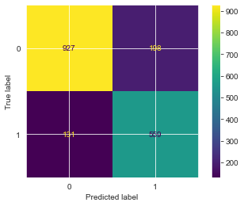

<h1 align="center"> Lead Scoring Classification </h1>

    

# Problem Statement
## Context
Sebuah perusahaan pendidikan bernama X Education menjual kursus online kepada para profesional industri. Pada hari tertentu, banyak profesional yang tertarik dengan kursus tersebut denga membuka situs web mereka dan mencari kursus.

Perusahaan memasarkan kursusnya di beberapa situs web dan mesin pencari seperti Google. Setelah orang-orang ini membuka situs web, mereka mungkin mencari kursus atau mengisi formulir untuk kursus atau menonton beberapa video. Ketika orang-orang ini mengisi formulir yang memberikan alamat email atau nomor telepon mereka, mereka diklasifikasikan sebagai "Prospek". Selain itu, perusahaan juga mendapatkan arahan melalui referensi sebelumnya. Setelah prospek ini diperoleh, karyawan dari tim penjualan mulai menelepon, menulis email, dan lain-lain. Melalui proses ini, beberapa prospek dikonversi sementara sebagian besar tidak. Tingkat konversi prospek pada pendidikan X adalah sekitar 30%.

Sekarang, meskipun X Education mendapatkan banyak prospek, tingkat konversi prospeknya sangat buruk. Misalnya, mereka memperoleh 100 prospek dalam sehari, hanya sekitar 30 di antaranya yang dikonversi. Untuk membuat proses ini lebih efisien, perusahaan ingin mengidentifikasi prospek paling potensial, juga dikenal sebagai "Hot Prospek". Jika mereka berhasil mengidentifikasi kumpulan prospek ini, tingkat konversi prospek akan naik karena tim penjualan sekarang akan lebih fokus untuk berkomunikasi dengan prospek potensial daripada menelepon semua orang.

Ada banyak prospek yang dihasilkan pada tahap awal, tetapi hanya sedikit dari mereka yang keluar sebagai pelanggan yang membayar. Di tahap ini, Anda perlu memelihara prospek potensial dengan baik (yaitu memperkenalkan prospek tentang produk, terus berkomunikasi, dan lain-lain) untuk mendapatkan konversi prospek yang lebih tinggi.

X Education ingin memilih prospek yang paling menjanjikan, yaitu prospek yang kemungkinan besar akan dikonversi menjadi pelanggan yang membayar. Perusahaan mengharuskan Anda untuk membangun model di mana Anda perlu menetapkan skor prospek untuk setiap prospek sehingga pelanggan dengan skor prospek yang lebih tinggi memiliki peluang konversi yang lebih tinggi dan pelanggan dengan skor prospek yang lebih rendah memiliki peluang konversi yang lebih rendah. CEO, khususnya, telah memberikan rata-rata target tingkat konversi prospek menjadi sekitar 80%.

## Business Goals
Buat model untuk menetapkan skor prospek antara 0 sampai 100 untuk setiap prospek yang dapat digunakan oleh perusahaan untuk menargetkan prospek potensial. Skor yang lebih tinggi berarti "Hot Lead", yaitu kemungkinan besar akan dikonversi sedangkan skor lebih rendah berarti "Cold Lead" dan kemungkinan tidak akan dikonversi. 

## Data Dictionary

| Variables                                        	| Description                                                                                                                         	|
|--------------------------------------------------	|-------------------------------------------------------------------------------------------------------------------------------------	|
| Prospect ID                                      	| ID unik setiap pelanggan                                                                                                            	|
| Lead Number                                      	| Nomor prospek yang ditetapkan untuk setiap prospek yang diperoleh.                                                                  	|
| Lead Origin                                      	| Pengidentifikasi asal pelanggan diidentifikasi sebagai prospek.                                                                     	|
| Lead Source                                      	| Sumber prospek                                                                                                                      	|
| Do Not Email                                     	| Variabel indikator yang dipilih oleh pelanggan di mana mereka memilih apakah mereka ingin dikirimi email tentang kursus atau tidak. 	|
| Do Not Call                                      	| Variabel indikator yang dipilih oleh pelanggan di mana mereka memilih apakah mereka ingin dihubungi tentang kursus atau tidak.      	|
| Converted                                        	| Variabel target. Menunjukkan apakah prospek telah berhasil dikonversi atau tidak.                                                   	|
| TotalVisits                                      	| Jumlah total kunjungan yang dilakukan oleh pelanggan di situs web.                                                                  	|
| Total Time Spent on Website                      	| Total waktu yang dihabiskan oleh pelanggan di situs web.                                                                            	|
| Page Views Per Visit                             	| Jumlah rata-rata halaman di situs web yang dilihat selama kunjungan.                                                                	|
| Last Activity                                    	| Aktivitas terakhir yang dilakukan oleh pelanggan.                                                                                   	|
| Country                                          	| Negara pelanggan                                                                                                                    	|
| Specialization                                   	| Domain industri tempat pelanggan bekerja sebelumnya.                                                                                	|
| How did you hear about X Education               	| Sumber dari mana pelanggan mendengar tentang X Education.                                                                           	|
| What is your current occupation                  	| Menunjukkan apakah pelanggan adalah pelajar, pengangguran atau bekerja.                                                             	|
| What matters most to you in choosing this course 	| Opsi yang dipilih oleh pelanggan yang menunjukkan apa tujuan utama mereka mengikuti kursus ini.                                     	|
| Search                                           	| Menunjukkan apakah pelanggan telah melihat iklan di salah satu item yang terdaftar.                                                 	|
| Magazine                                         	| Menunjukkan apakah pelanggan telah melihat iklan di salah satu item yang terdaftar.                                                 	|
| Newspaper Article                                	| Menunjukkan apakah pelanggan telah melihat iklan di salah satu item yang terdaftar.                                                 	|
| X Education Forums                               	| Menunjukkan apakah pelanggan telah melihat iklan di salah satu item yang terdaftar.                                                 	|
| Newspaper                                        	| Menunjukkan apakah pelanggan telah melihat iklan di salah satu item yang terdaftar.                                                 	|
| Digital Advertisement                            	| Menunjukkan apakah pelanggan telah melihat iklan di salah satu item yang terdaftar.                                                 	|
| Through Recommendations                          	| Menunjukkan apakah pelanggan datang melalui rekomendasi.                                                                            	|
| Receive More Updates About Our Courses           	| Menunjukkan apakah pelanggan memilih untuk menerima lebih banyak pembaruan tentang kursus.                                          	|
| Tags                                             	| Tag yang ditetapkan ke pelanggan yang menunjukkan status prospek saat ini.                                                          	|
| Lead Quality                                     	| Menunjukkan kualitas prospek berdasarkan data dan intuisi karyawan yang telah ditugaskan untuk prospek.                             	|
| Update me on Supply Chain Content                	| Menunjukkan apakah pelanggan menginginkan pembaruan pada konten.                                                                    	|
| Get updates on DM Content                        	| Menunjukkan apakah pelanggan menginginkan pembaruan pada Konten DM.                                                                 	|
| Lead Profile                                     	| Tingkat prospek yang ditetapkan untuk setiap pelanggan berdasarkan profil mereka.                                                   	|
| City                                             	| Kota pelanggan                                                                                                                      	|
| Asymmetrique Activity Index                      	| Indeks dan skor yang diberikan kepada setiap pelanggan berdasarkan aktivitas dan profil mereka                                      	|
| Asymmetrique Profile Index                       	| Indeks dan skor yang diberikan kepada setiap pelanggan berdasarkan aktivitas dan profil mereka                                      	|
| Asymmetrique Activity Score                      	| Indeks dan skor yang diberikan kepada setiap pelanggan berdasarkan aktivitas dan profil mereka                                      	|
| Asymmetrique Profile Score                       	| Indeks dan skor yang diberikan kepada setiap pelanggan berdasarkan aktivitas dan profil mereka                                      	|
| I agree to pay the amount through cheque         	| Menunjukkan apakah pelanggan telah setuju untuk membayar jumlah melalui cek atau tidak.                                             	|
| a free copy of Mastering The Interview           	| Menunjukkan apakah pelanggan menginginkan salinan gratis 'Mastering the Interview' atau tidak.                                      	|
| Last Notable Activity                            	| Kegiatan penting terakhir yang dilakukan oleh siswa.                                                                                	|

# Work Steps
1. Problem Statement
   - Context
   - Business Goals
   - Data Dictionary
2. Data Exploration
   - Load Dataset
   - Data Information
   - Statistics Description
   - Check Null Values
   - Check Duplicated Data
3. Data Cleansing
   - Handling Missing Value
   - Handling Inconsistent Data
   - Check Unique Values
   - Check Cardinality
4. Exploratory Data Analysis
   - Univariate Analysis
   - Bivariate Analysis
   - Remove Feature with Imbalanced Category
5. Feature Engineering
   - Feature Encoding 
   - Feature Scaling 
   - Feature Selection
6. Sample Dataset 
   - Separate Train and Test Set
   - Oversampling Using SMOTE
7. Modelling
   - Choose Best Model
   - Hyperparameter Tuning
8. Model Evaluation
   - Confusion Matrix
   - Classification Report
   - Precision Recall and ROC Curve
   - Feature Importance
   - Thresholds Adjusment
9. Save Model

# Feature Selection
Karena terlalu banyak feature dan hal tersebut dapat menyebabkan model sulit untuk dilatih (memerlukan waktu lama), maka pada tahap ini dilakukan feature selection sebagnyak 20 feature terbaik menggunakan Recursive Feature Elimination (RFE). Setelah dilakukan feature selection maka didapatkan 20 feature terbaik seperti berikut :

| Do Not Email 	| TotalVisits 	| Total Time Spent on Website 	| Page Views Per Visit 	| Lead Origin_API 	| Lead Origin_Landing Page Submission 	| Lead Origin_Lead Add Form 	| Lead Source_Direct Traffic 	| Lead Source_Olark Chat 	| Lead Source_Welingak Website 	| Last Activity_Converted to Lead 	| Last Activity_Email Bounced 	| Last Activity_Email Opened 	| Last Activity_Olark Chat Conversation 	| Last Activity_Other Activity 	| Last Activity_SMS Sent 	| Specialization_Other 	| What is your current occupation_Other 	| What is your current occupation_Student 	| What is your current occupation_Working Professional 	| Converted 	|   	|
|-------------:	|------------:	|----------------------------:	|---------------------:	|----------------:	|------------------------------------:	|--------------------------:	|---------------------------:	|-----------------------:	|-----------------------------:	|--------------------------------:	|----------------------------:	|---------------------------:	|--------------------------------------:	|-----------------------------:	|-----------------------:	|---------------------:	|--------------------------------------:	|----------------------------------------:	|-----------------------------------------------------:	|----------:	|---	|
|            0 	|           0 	|                       -0.75 	|            -0.269811 	|       -0.909091 	|                                   1 	|                         0 	|                          0 	|                      0 	|                            1 	|                               0 	|                           0 	|                          0 	|                                     0 	|                            0 	|                      0 	|                    0 	|                                     1 	|                                       0 	|                                                    0 	|         0 	| 0 	|
|            1 	|           0 	|                        0.50 	|             0.469427 	|        0.227273 	|                                   1 	|                         0 	|                          0 	|                      0 	|                            0 	|                               0 	|                           0 	|                          0 	|                                     1 	|                            0 	|                      0 	|                    0 	|                                     1 	|                                       0 	|                                                    0 	|         0 	| 0 	|
|            2 	|           0 	|                       -0.25 	|             1.410474 	|        0.000000 	|                                   0 	|                         1 	|                          0 	|                      1 	|                            0 	|                               0 	|                           0 	|                          0 	|                                     1 	|                            0 	|                      0 	|                    0 	|                                     0 	|                                       0 	|                                                    1 	|         0 	| 1 	|
|            3 	|           0 	|                       -0.50 	|             0.064711 	|       -0.454545 	|                                   0 	|                         1 	|                          0 	|                      1 	|                            0 	|                               0 	|                           0 	|                          0 	|                                     0 	|                            0 	|                      0 	|                    0 	|                                     0 	|                                       0 	|                                                    0 	|         0 	| 0 	|
|            4 	|           0 	|                       -0.25 	|             1.296408 	|       -0.454545 	|                                   0 	|                         1 	|                          0 	|                      0 	|                            0 	|                               0 	|                           1 	|                          0 	|                                     0 	|                            0 	|                      0 	|                    0 	|                                     1 	|                                       0 	|                                                    0 	|         0 	| 1 	|

# Modelling : Choose Best Classifier
Pada tahap modelling ini dilakukan uji coba pada beberapa model klasifikasi, lalu dibanding mana yang mempunyai performa terbaik untuk nentinya dilakukan hyperparameters tuning. Dari hasil percobaan yang dilakukan, berikut performa pada beberapa model yang telah dilakukan training :
## Cross Validation 
Dari hasil cross validation dengan folds = 5, didapatkan akurasi pada setiap k-fold sebagai berikut :
|                      Model 	|        0 	|        1 	|        2 	|        3 	|        4 	|
|---------------------------:	|---------:	|---------:	|---------:	|---------:	|---------:	|
|     DecisionTreeClassifier 	| 0.767493 	| 0.768044 	| 0.769146 	| 0.780165 	| 0.769570 	|
|     RandomForestClassifier 	| 0.792837 	| 0.809366 	| 0.788430 	| 0.793388 	| 0.791069 	|
|         AdaBoostClassifier 	| 0.828650 	| 0.833609 	| 0.824242 	| 0.827548 	| 0.815325 	|
|       ExtraTreesClassifier 	| 0.788981 	| 0.796143 	| 0.779614 	| 0.788430 	| 0.783352 	|
| GradientBoostingClassifier 	| 0.827548 	| 0.840771 	| 0.833058 	| 0.834160 	| 0.821940 	|
|          BaggingClassifier 	| 0.800000 	| 0.805510 	| 0.795041 	| 0.791736 	| 0.795480 	|
|       KNeighborsClassifier 	| 0.805510 	| 0.821488 	| 0.793388 	| 0.795041 	| 0.802095 	|
|         LogisticRegression 	| 0.831405 	| 0.822039 	| 0.816529 	| 0.817080 	| 0.799890 	|
|                 GaussianNB 	| 0.773554 	| 0.771901 	| 0.760331 	| 0.778512 	| 0.750827 	|
|                        SVC 	| 0.838017 	| 0.834711 	| 0.828650 	| 0.819284 	| 0.816979 	|
|              XGBClassifier 	| 0.815978 	| 0.828099 	| 0.820937 	| 0.817631 	| 0.821940 	|
|              MLPClassifier 	| 0.826446 	| 0.829201 	| 0.826446 	| 0.818182 	| 0.819184 	|

Lalu kalkulasikan rata-rata dan standard deviasi nilai akurasi. Maka didapatkan hasil sebagai berikut :

|                      Model 	| score_mean 	| score_std 	|
|---------------------------:	|-----------:	|----------:	|
| GradientBoostingClassifier 	|   0.831496 	|  0.006363 	|
|                        SVC 	|   0.827528 	|  0.008272 	|
|         AdaBoostClassifier 	|   0.825875 	|  0.006071 	|
|              MLPClassifier 	|   0.823892 	|  0.004382 	|
|              XGBClassifier 	|   0.820917 	|  0.004191 	|
|         LogisticRegression 	|   0.817388 	|  0.010248 	|
|       KNeighborsClassifier 	|   0.803504 	|  0.010034 	|
|          BaggingClassifier 	|   0.797553 	|  0.004770 	|
|     RandomForestClassifier 	|   0.795018 	|  0.007379 	|
|       ExtraTreesClassifier 	|   0.787304 	|  0.005603 	|
|     DecisionTreeClassifier 	|   0.770884 	|  0.004700 	|
|                 GaussianNB 	|   0.767025 	|  0.010055 	|

Dari hasil diatas, Gradient Boosting Classifier menjadi model dengan rata-rata akurasi terbesar, yaitu 83.14% dengan standard deviasi akurasi 0.006363.

Selain dengan menggunakan Cross Validation, saya juga melakukan uji nilai akurasi pada data training dan testing yang bertujuan untuk melihat akurasi pada data training dan testing. Maka di dapatkan hasil sebagai berikut :

|                      Model 	| train score 	| test score 	| difference 	|
|---------------------------:	|------------:	|-----------:	|-----------:	|
|         AdaBoostClassifier 	|    0.823660 	|   0.826446 	|   0.002787 	|
|         LogisticRegression 	|    0.814134 	|   0.806612 	|   0.007522 	|
|                        SVC 	|    0.836730 	|   0.823140 	|   0.013590 	|
| GradientBoostingClassifier 	|    0.842379 	|   0.826997 	|   0.015382 	|
|              MLPClassifier 	|    0.843620 	|   0.816198 	|   0.027422 	|
|                 GaussianNB 	|    0.744240 	|   0.776860 	|   0.032619 	|
|       KNeighborsClassifier 	|    0.861874 	|   0.800000 	|   0.061874 	|
|              XGBClassifier 	|    0.897541 	|   0.816529 	|   0.081012 	|
|          BaggingClassifier 	|    0.956690 	|   0.791956 	|   0.164734 	|
|     RandomForestClassifier 	|    0.969517 	|   0.777190 	|   0.192327 	|
|       ExtraTreesClassifier 	|    0.969539 	|   0.771460 	|   0.198079 	|
|     DecisionTreeClassifier 	|    0.969539 	|   0.758567 	|   0.210972 	|

Terlihat bahwa AdaBoostClassifier memiliki perbedaan nilai akurasi terkecil, dengan selisih sekitar 0.2%. Meskipun AdaBoostClassifier memiliki perbedaan nilai terkecil, tetapi untuk nilai akurasi pada data training dan testing lebih kecil daripada model yang lain. DecisionTreeClassifier memiliki nilai akurasi yang sangat tinggi pada data training, tetapi memiliki nilai akurasi yang cukup kecil pada data testing dengan perbedaan mencapai 21%. Bisa dikatakan bahwa DecisionTreeClassifier mengalami overfitting. 

## Cross Validation with Some Metrics
Kali ini kita akan lakukan cross validation untuk mengukur performa model dengan beberapa metrik, yaitu accuracy, precision, recall, dan f1-score. Maka didapatkan hasil sebagai berikut :

|    	|                      Model 	|  fit_time 	| score_time 	| test_accuracy 	| test_precision 	| test_recall 	|  test_f1 	|
|---:	|---------------------------:	|----------:	|-----------:	|--------------:	|---------------:	|------------:	|---------:	|
|  0 	| GradientBoostingClassifier 	|  1.659360 	|   0.020021 	|      0.831496 	|       0.792605 	|    0.751674 	| 0.771544 	|
|  1 	|                        SVC 	|  3.681560 	|   2.111158 	|      0.827528 	|       0.789867 	|    0.741776 	| 0.764953 	|
|  2 	|              MLPClassifier 	| 15.025849 	|   0.015101 	|      0.826647 	|       0.776302 	|    0.761572 	| 0.768833 	|
|  3 	|         AdaBoostClassifier 	|  0.705404 	|   0.066235 	|      0.825875 	|       0.788558 	|    0.737991 	| 0.762400 	|
|  4 	|              XGBClassifier 	|  2.230922 	|   0.029396 	|      0.820917 	|       0.774588 	|    0.743231 	| 0.758506 	|
|  5 	|         LogisticRegression 	|  0.197957 	|   0.013317 	|      0.817388 	|       0.790414 	|    0.704512 	| 0.744889 	|
|  6 	|       KNeighborsClassifier 	|  0.015494 	|   0.812301 	|      0.803504 	|       0.748575 	|    0.724600 	| 0.736204 	|
|  7 	|          BaggingClassifier 	|  0.395089 	|   0.026363 	|      0.799096 	|       0.753326 	|    0.697817 	| 0.724440 	|
|  8 	|     RandomForestClassifier 	|  1.494093 	|   0.109366 	|      0.795128 	|       0.736063 	|    0.715284 	| 0.725436 	|
|  9 	|       ExtraTreesClassifier 	|  1.737872 	|   0.115615 	|      0.789949 	|       0.727655 	|    0.711499 	| 0.719397 	|
| 10 	|     DecisionTreeClassifier 	|  0.066657 	|   0.014699 	|      0.771214 	|       0.699931 	|    0.692576 	| 0.696208 	|
| 11 	|                 GaussianNB 	|  0.020765 	|   0.022171 	|      0.767025 	|       0.848328 	|    0.468122 	| 0.602881 	|

Dari hasil diatas, GradientBoostingClassifier memiliki nilai akurasi dan dan recall yang paling tinggi dari keseluruhan model. Selain nilai akurasi, recall juga akan kita perhitungkan karena **kita lebih ingin model kita dapat mengklasifikasi lebih banyak False Positive(FP) daripada False Negative (FN)**. 
FP pada kasus ini yaitu model memprediksi prospek akan dikonversi, tetapi sebenarnya tidak dikonversi. Maka FP lebih baik daripada FN. FN yaitu model memprediksi prospek tidak akan di konversi tetapi sebenarnya dapat dikonversi, dan hal ini dapat menyebabkan semakin banyak prospek yang tidak jadi dikonversi.  

> Dari keseluruhan proses diatas, maka saya akan memilih model **GradientBoostingClassifier** karena memiliki nilai akurasi dan recall yang cukup tertinggi daripada model lain. Meskipun perbedaan akurasi nya lebih besar dari AdaBoostClassifier, tetapi AdaBoostClassifier tidak cukup besar pada nilai akurasi dan recall daripada GradientBoostingClassifier.

## Gradient Boosting Classifier
Setelah dipilih Gradient Boosting sebagai model yang akan digunakan pada pembuatan model, selanjutnya dilakukan perbanding performa antara Gradient Boosting menggunakan default parameter dan parameter hasil tuning. Hyperparameter Tuning dilakukan menggunakan GridSearchCV dengan 5 k-folds. Setelah dilakukan perbandingan, maka didapatkan hasil sebagai berikut:

|             	| train_acc 	| test_acc 	| precision 	| recall 	|
|------------:	|----------:	|---------:	|----------:	|-------:	|
| gbc_default 	|     84.24 	|    82.70 	|     76.78 	|  78.12 	|
|   gbc_tuned 	|     91.80 	|    81.27 	|     73.46 	|  79.42 	|

Note :  
gbc_default = Default Parameter  
gbc_tuned = hyperparameter tuning

Pada hasil diatas dapat dilihat hasil training menggunakan default parameter dan hyperparameter tuning. Dari hasil training menggunakan hyperparameter tuning, model dapat memperoleh akurasi mencapai sekitar 91.80% pada data training, tetapi menurun menjadi sekitar 81.27% pada data testing. Pada training menggunakan default parameter, model menghasilkan akurasi sekitar 84.24% pada data training dan 82.70% pada data testing. GradientBoosting dengan menggunakan default parameter menghasilkan nilai recall lebih kecil daripada pada GradientBoosting hasil hyperparameter tuning dengan perbedaan sekitar 1%.

> Dari hasil diatas, hyperparameter tuning meningkatkan akurasi dan recall pada data training dan menurunkan nilai akurasi pada data testing. Maka dapat dikatakan bahwa bahwa model mengalami sedikit overfitting. Maka pada training model ini **saya akan memilih model GradientBoostingClassifier dengan default parameter** karena perbedaan akurasi pada data training dan testing tidak terlalu jauh. Meskipun nilai recall nya lebih kecil dari pada model hasil hyperparameter tuning,tetapi perbedaannya tidak terlalu jauh.

# Model Evaluation

## Confusion Matrix
|       	| pred 0 	| pred 1 	|
|-------	|--------	|--------	|
| act 0 	| 962    	| 163    	|
| act 1 	| 151    	| 539    	|

    

## Classification Report
                    precision    recall  f1-score   support

                 0       0.86      0.86      0.86      1125
                 1       0.77      0.78      0.77       690

          accuracy                           0.83      1815
         macro avg       0.82      0.82      0.82      1815
      weighted avg       0.83      0.83      0.83      1815

## Precision Recall and ROC Curve

    

## Feature Importance

| Features                                           	| importance 	|
|----------------------------------------------------	|------------	|
| Total Time Spent on Website                        	| 0.353334   	|
| Lead Origin_Lead Add Form                          	| 0.192933   	|
| Last Activity_SMS Sent                             	| 0.121323   	|
| What is your current occupation_Other              	| 0.106588   	|
| What is your current occupation_Working Profess... 	| 0.054558   	|
| TotalVisits                                        	| 0.036197   	|
| Page Views Per Visit                               	| 0.027765   	|
| Do Not Email                                       	| 0.022288   	|
| Last Activity_Olark Chat Conversation              	| 0.020304   	|
| Lead Origin_Landing Page Submission                	| 0.018683   	|
| Last Activity_Email Opened                         	| 0.010369   	|
| Specialization_Other                               	| 0.009457   	|
| Last Activity_Email Bounced                        	| 0.007280   	|
| Lead Source_Direct Traffic                         	| 0.005328   	|
| Last Activity_Converted to Lead                    	| 0.004809   	|
| What is your current occupation_Student            	| 0.003145   	|
| Lead Source_Olark Chat                             	| 0.002057   	|
| Lead Source_Welingak Website                       	| 0.001327   	|
| Lead Origin_API                                    	| 0.001256   	|
| Last Activity_Other Activity                       	| 0.001000   	|

    

## Thresholds Adjusment
Area Under the ROC Curve 0.9051826086956521

|     	|   fpr 	|      tpr 	| 1-fpr 	|        tf 	| thresholds 	|
|----:	|------:	|---------:	|------:	|----------:	|-----------:	|
| 254 	| 0.176 	| 0.814493 	| 0.824 	| -0.009507 	|   0.440399 	|

    

Dari hasil diatas didapatkan thresholds paling ideal, yaitu 0.440399.  
Setelah didapatkan thresholds yang optimal, maka thresholds tersebut akan kita gunakan untuk klasifikasi.
- Jika lebih dari nilai tersebut maka termasuk "Hot Lead"
- JIka sebaliknya berarti "Cold Lead".

|   	| Converted 	| Converted_Prob 	| final_prediction 	|
|--:	|----------:	|---------------:	|-----------------:	|
| 0 	|         0 	|       0.070802 	|                0 	|
| 1 	|         0 	|       0.587419 	|                1 	|
| 2 	|         0 	|       0.434593 	|                0 	|
| 3 	|         0 	|       0.121257 	|                0 	|
| 4 	|         0 	|       0.110994 	|                0 	|
| 5 	|         0 	|       0.067218 	|                0 	|
| 6 	|         1 	|       0.869893 	|                1 	|
| 7 	|         0 	|       0.853252 	|                1 	|
| 8 	|         0 	|       0.120033 	|                0 	|
| 9 	|         1 	|       0.360300 	|                0 	|

### Confusion Matrix

|        	| pred 0 	| pred 1 	|
|--------	|--------	|--------	|
| act 0  	| 927    	| 198    	|
| act 1  	| 131    	| 559    	|

    

### Classification Report
                  precision    recall  f1-score   support

                 0       0.88      0.82      0.85      1125
                 1       0.74      0.81      0.77       690

          accuracy                           0.82      1815
         macro avg       0.81      0.82      0.81      1815
      weighted avg       0.82      0.82      0.82      1815

# Summary
Dari hasil Precision Recall Cut-Off point, output dari model terlihat mengalami perbedaan :  
**Tanpa Precision Recall Trade-Off** : 
- TP (539)
- TN (962)
- FP (163)
- FN (151)  

Accuracy = 82.64%  
Precision = 76.67%  
Recall = 78.11%

**Dengan Precision Recall Trade-Off** :
- TP (559)
- TN (927)
- FP (198)
- FN (131)

Accuracy = 81.87%  
Precision = 73.84%  
Recall = 81.01%

Pada tujuan awal kita, CEO ingin mengidentifikasi prospek yang akan dikonversi. Dari hasil penggunaan thresholds maka didapatkan hasil :
- TP meningkat
- TN menurun
- FP meningkat 
- FN menurun

> Karena menggunakan nilai thresholds menyebabkan peningkatan pada True Positive dan False Positive, dan hal tersebut memperbesar nilai recall, maka kita akan menggunakan thresholds **untuk menentukan apakah prospek tersebut dapat dikonversi atau tidak**.

